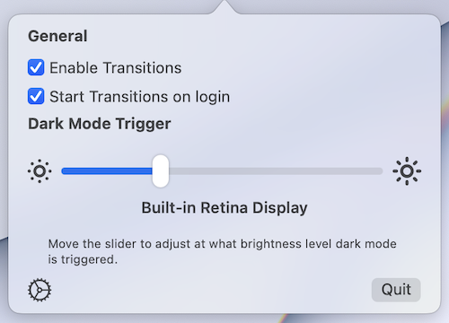

# Transitions

Transitions is a small macOS utility that automatically triggers system-wide dark mode based on screen brightness. It supports reading brightness from external monitors that support the DDC standard. 

Note that as of version `0.1.1`, this app has not been validated and probably does not work with Apple-branded displays. If I ever get one of those I will add that functionality 😅

## Installation

The app comes with a dmg installer, mount this and simply drag the `.app` into your Applications directory.

## Usage

The app by default shows a menu bar icon, where some quick settings can be toggled. The menu bar icon can be turned off.

Adjust the slider to change the trigger point of when dark mode should be enabled system-wide. The highlighted portion of the progress bar represents the current screen brightness percentage. 

In short, drag the slider to the left to decrease the amount of brightness required before the app changes the interface style to dark.

## Development Environment Setup

The project should build straight from Xcode without changing anything, but for releases and using fastlane some more dependencies need to be installed:

1. `fastlane` itself: `brew install fastlane`
2. The `release` lane uses a shell script that depends on `create-dmg`. Install this via `brew install create-dmg`